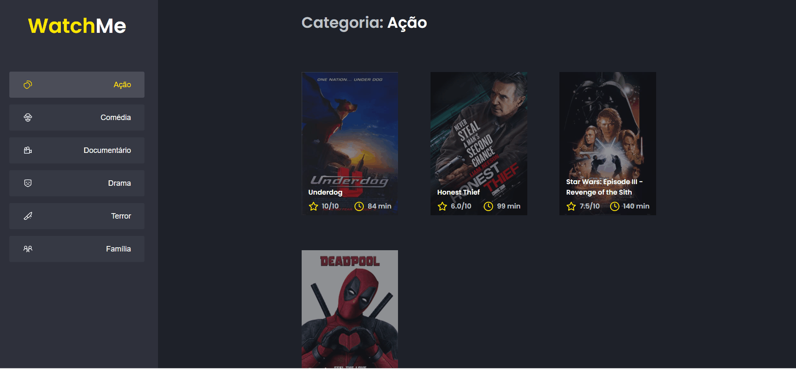

<h1 align="center">
  <span>Desafio: Componentizando a aplicação</span>
</h1>

<p align="center">
  <a href="#-projeto">Projeto</a>&nbsp;&nbsp;&nbsp;|&nbsp;&nbsp;&nbsp;
  <a href="#-tecnologias">Tecnologias</a>&nbsp;&nbsp;&nbsp;|&nbsp;&nbsp;&nbsp;
  <a href="#-layout">Layout</a>&nbsp;&nbsp;&nbsp;|&nbsp;&nbsp;&nbsp;
  <a href="#-instalação">Instalação</a>&nbsp;&nbsp;&nbsp;|&nbsp;&nbsp;&nbsp;
  <a href="#memo-licença">Licença</a>
</p>

<br>

<p align="center">
  
</p>

<br>

## 💻 Projeto

Nesse desafio, o principal objetivo é refatorar uma página para listagem de filmes de acordo com gênero.

A aplicação já está totalmente funcional mas grande parte do seu código está diretamente no arquivo App.tsx. Para resolver isso da melhor forma, é necessário dividir a aplicação em pelo menos duas partes principais: sidebar e o conteúdo principal que possui o header e a listagem de filmes.

* A aplicação possui apenas uma funcionalidade principal que é a listagem de filmes;
* Na sidebar é possível selecionar qual categoria de filmes deve ser listada;
* A primeira categoria da lista (que é "Ação") já deve começar como marcada;
* O header da aplicação possui apenas o nome da categoria selecionada que deve mudar dinamicamente.

## 🚀 Tecnologias

Esse projeto foi desenvolvido com as seguintes tecnologias:

- HTML
- CSS
- TypeScript
- ReactJS

## 🔖 Layout

O layout foi fornecido, bem como a estrutura do projeto. Para mais detalhes, [acesse a nota criada no Notion](https://www.notion.so/Desafio-02-Componentizando-a-aplica-o-b9f0f025c95b437699d0c3115f55b0f1).

## 📥 Instalação

Faça um clone desse repositório e acesse o diretório.

```bash
# Instalando as dependências
$ yarn

# Executanto o servidor
yarn server

# Executanto aplicação
$ yarn dev
```

## :memo: Licença

Esse projeto está sob a licença MIT. Veja o arquivo [LICENSE](LICENSE.md) para mais detalhes.

---
**Desenvolvido por [Bruno César](https://github.com/brunocs90).**
